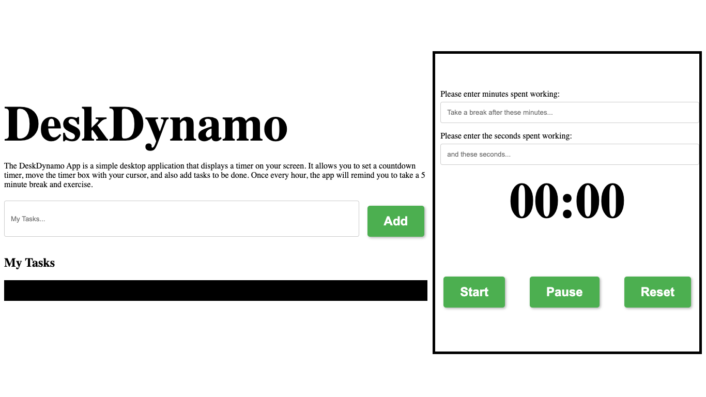
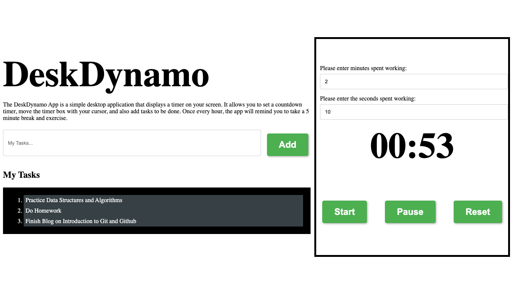
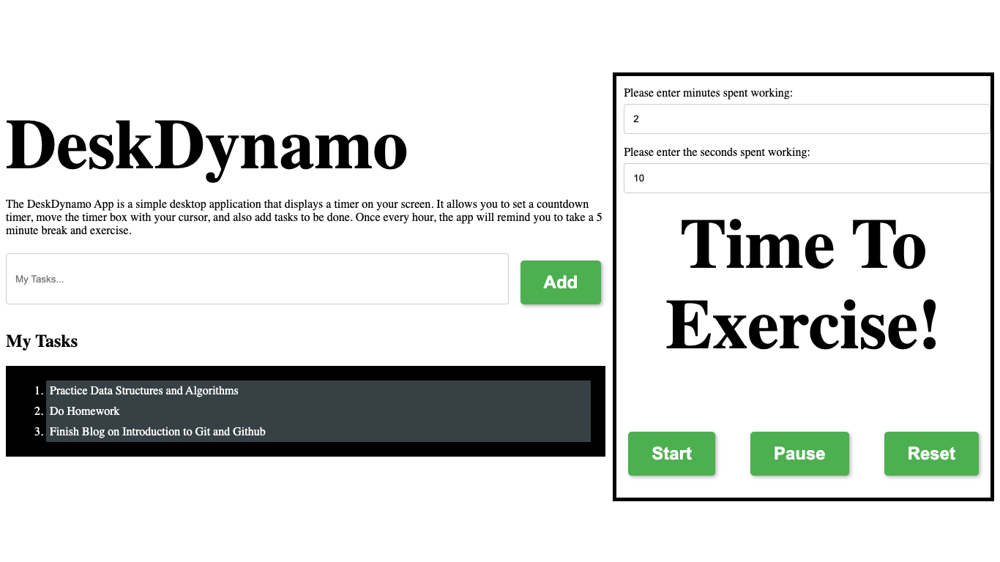

# **DeskDynamo**

The DeskDynamo App is a simple desktop application that displays a timer on your screen. It allows you to set a countdown timer, move the timer box with your cursor, and also add tasks to be done. Once every hour, the app will remind you to take a 5 minute break and exercise as per the duration specified by the user.

## **Features**

- Set a countdown timer
- Move the timer box with your cursor
- Add tasks to be done
- Hourly reminders to take a break and exercise

## DeskDynamo Interface

## DeskDynamo Working

## DeskDynamo Interface

## **Installation**

To use the DeskDynamo, follow these steps:

1. Download and Install Node.js

2. Clone the DeskDynamo App repository from GitHub:

&nbsp;&nbsp;&nbsp;&nbsp;&nbsp;&nbsp;`git clone https://github.com/SaarthakMaini/DeskDynamo.git`

3. Navigate to the DeskDynamo App directory:

&nbsp;&nbsp;&nbsp;&nbsp;&nbsp;&nbsp;`cd DeskDynamo`

4. Install Electron:

&nbsp;&nbsp;&nbsp;&nbsp;&nbsp;&nbsp;`npm install electron --save-dev`

5. Install the dependencies:

&nbsp;&nbsp;&nbsp;&nbsp;&nbsp;&nbsp;`npm install`

6. Start the app:

&nbsp;&nbsp;&nbsp;&nbsp;&nbsp;&nbsp;`npm start`

## **Usage**

Once you have installed and started the app, you can use it as follows:

### **Setting A Timer**

To set a timer, simply enter the number of minutes you want the timer to run for in the input field below the timer. Then click the "Start" button to start the timer. The timer will count down the minutes and seconds, and will display a message once the time is up.

### **Moving The Timer Box**

You can move the timer box around your screen by clicking and dragging it with your cursor.

### **Adding Tasks**

You can add tasks to be done by entering them in the input field below the timer and clicking the "Add Task" button. The tasks will be displayed below the timer.

### **Hourly Reminders**

Once every hour, the app will remind you to take a 5 minute break and exercise. The app will display a message reminding you to do so.

## **Technologies Used**

The DeskDynamo App is built using the following technologies:

- Electron.js - a framework for building desktop applications using web technologies such as HTML, CSS, and JavaScript.
- Node.js - a JavaScript runtime that allows developers to run JavaScript on the server side.
- CSS - a stylesheet language used for describing the presentation of a document written in HTML.
- HTML - a markup language used for creating web pages.

## License

The software in this repository is released under the [MIT License](https://opensource.org/license/mit/).
